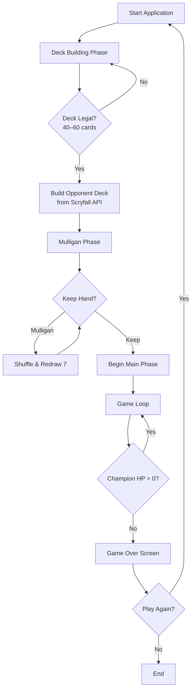
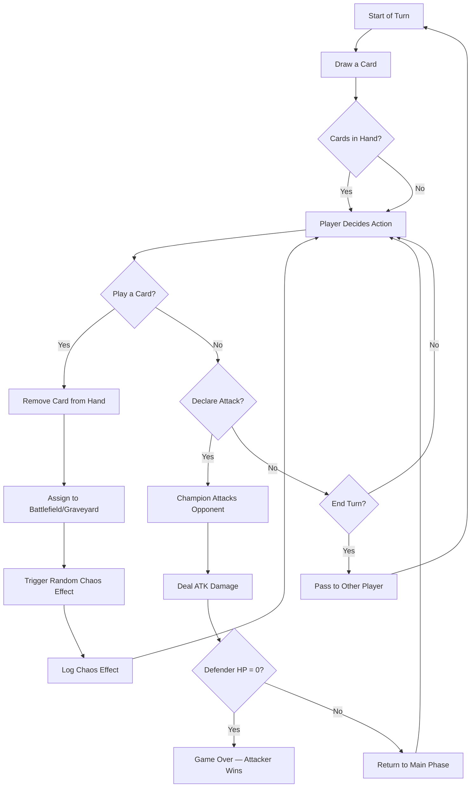
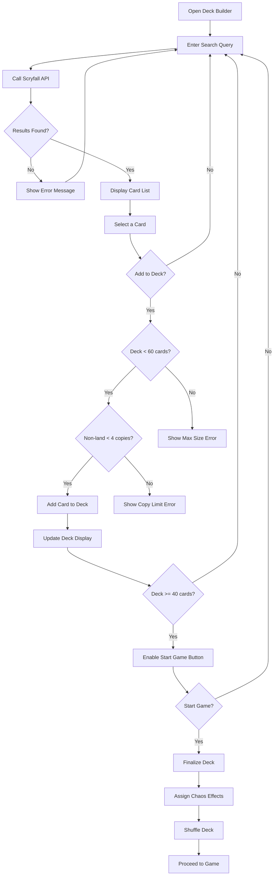
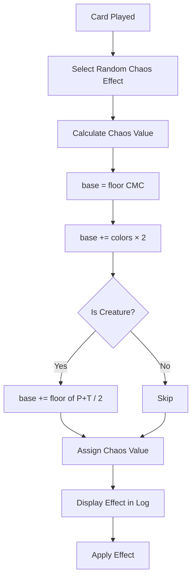
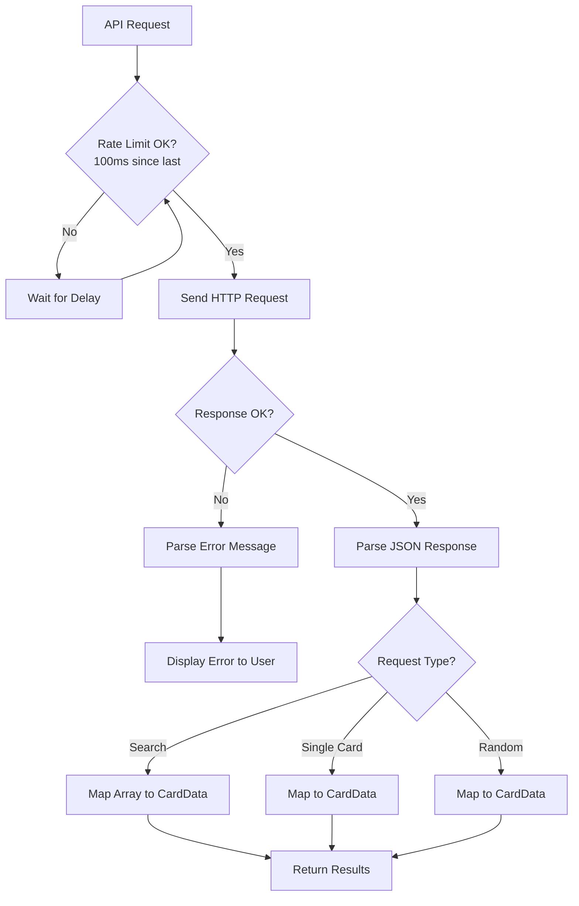
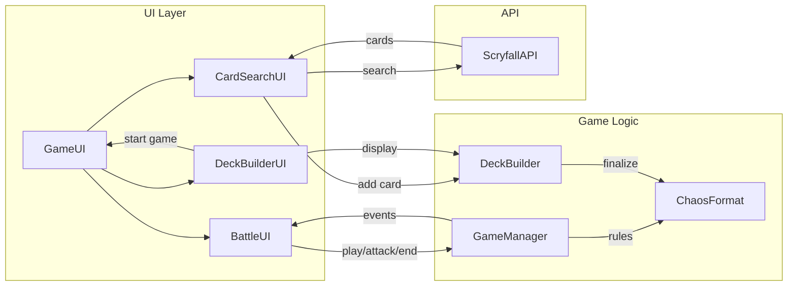
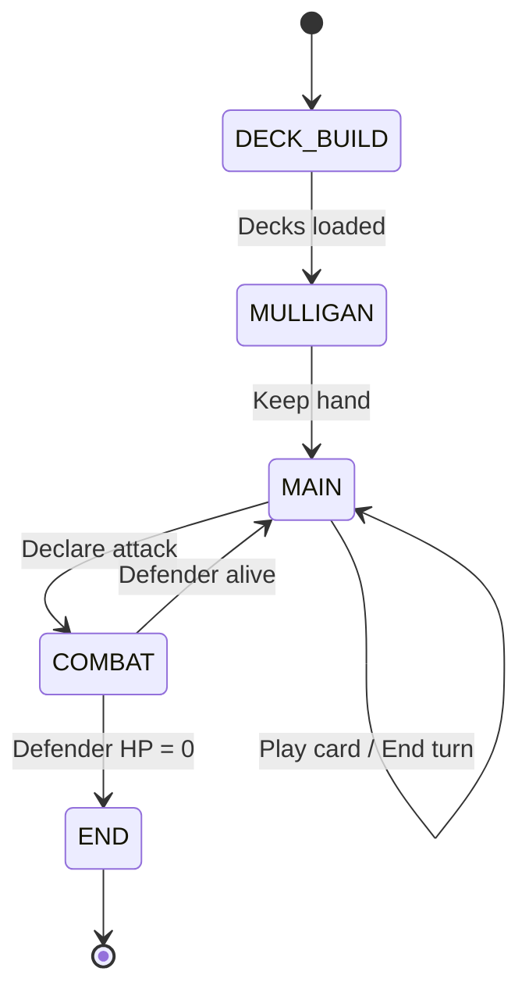

# Game Flowcharts

All diagrams use [Mermaid](https://mermaid.js.org/) syntax and can be rendered in GitHub, VS Code, or any Mermaid-compatible viewer.

## 1. Overall Game Flow

## 2. Turn Structure

## 3. Deck Building Flow

## 4. Chaos Effect Assignment

## 5. Scryfall API Flow

## 6. Component Communication

## 7. State Machine

